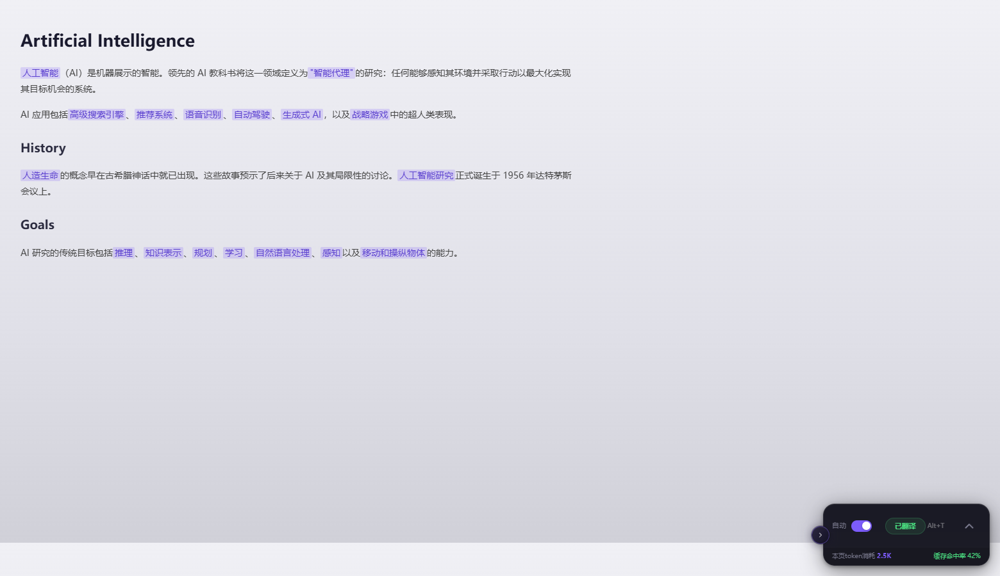
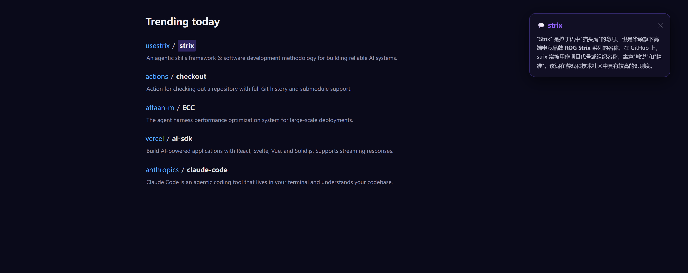
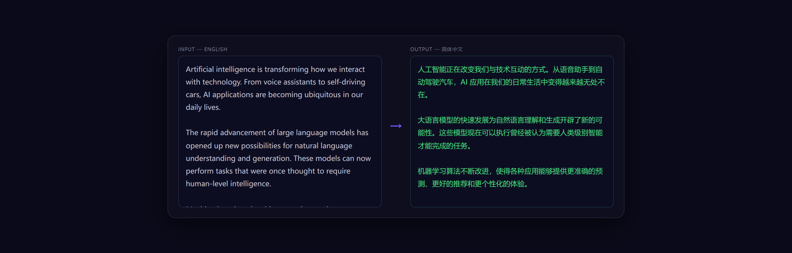
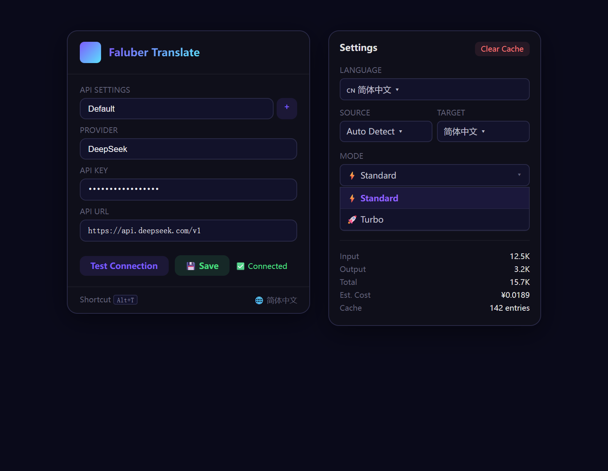

<div align="center">
  

  # 🌐 Faluber Translate

  ### AI 기반 웹페이지 번역 — 50개 언어, 10개 API 제공업체

  
  
  

  <br>

  <a href="https://github.com/hywihq-boop/faluber-translate/releases"></a>
  &nbsp;
  <a href="https://github.com/hywihq-boop/faluber-translate"></a>
</div>

<br>

> **Faluber Translate**는 AI 기반 Chrome 브라우저 번역 확장 프로그램입니다. iframe이나 오버레이 없이 DOM 텍스트 노드를 직접 교체합니다. **50개 대상 언어**, **10개 API 제공업체**, **듀얼 번역 모드**를 지원합니다.

---

## 📸 스크린샷

<div align="center">
  <p><em>⬇️ 전체 페이지 번역 + 플로팅 위젯 — 클릭 또는 <kbd>Alt+T</kbd></em></p>
  
  <br><br>

  <p><em>⬇️ Ctrl + 스마트 설명 — 단어에 호버 + <kbd>Ctrl</kbd> 탭</em></p>
  
  <br><br>

  <p><em>⬇️ 번역 패널 <kbd>Alt+Q</kbd> — 좌우 분할 입출력</em></p>
  
  <br><br>

  <p><em>⬇️ API 설정 & 모드 전환</em></p>
  
</div>

---

## ✨ 주요 기능

<table>
<tr>
<td width="50%">

### 🚀 원클릭 전체 페이지 번역
플로팅 위젯 클릭 또는 <kbd>Alt+T</kbd>로 전체 페이지 번역. 텍스트 노드 수준 DOM 치환으로 페이지 구조 보존.

</td>
<td width="50%">

### 🔍 Ctrl + 스마트 설명
단어에 호버 + <kbd>Ctrl</kbd> 탭으로 AI 설명 버블 표시. 텍스트 선택 + <kbd>Ctrl</kbd>으로 문단 설명.

</td>
</tr>
<tr>
<td width="50%">

### ⚡ 듀얼 번역 모드
**표준** — 3 동시, 뷰포트 우선.<br>
**터보** — 8 동시, 전체 페이지, 최대 속도.

</td>
<td width="50%">

### 🔑 다중 API 관리
10개 제공업체 프리셋 내장 (DeepSeek, OpenAI, Groq, Qwen...). 여러 설정 저장, 전환, 모델 자동 가져오기.

</td>
</tr>
<tr>
<td width="50%">

### 📋 번역 패널 <kbd>Alt+Q</kbd>
좌우 분할 플로팅 번역 패널. 즉시 번역, 페이지 번역과 독립적. 모든 언어 쌍 지원.

</td>
<td width="50%">

### 💾 스마트 캐시
메모리 + 영구 이중 캐시. 최대 2,000개 항목, 1시간 TTL. 자동 플러시 + `beforeunload`.

</td>
</tr>
</table>

---

## 📦 3단계로 시작

| 단계 | |
|------|---|
| **1. 설치** | [Releases](https://github.com/hywihq-boop/faluber-translate/releases)에서 zip 다운로드, 압축 해제 후 `chrome://extensions`에서 로드 |
| **2. API 설정** | 확장 아이콘 클릭 → 제공업체 선택 → API 키 입력 → 연결 테스트 → 저장 |
| **3. 번역** | 아무 페이지 열기 → 위젯 클릭 또는 <kbd>Alt+T</kbd> |

---

## 🔧 API 제공업체

| 제공업체 | API 기본 URL |
|---------|-------------|
| ⭐ DeepSeek | `https://api.deepseek.com/v1` |
| OpenAI | `https://api.openai.com/v1` |
| Groq | `https://api.groq.com/openai/v1` |
| Together AI | `https://api.together.xyz/v1` |
| OpenRouter | `https://openrouter.ai/api/v1` |
| SiliconFlow | `https://api.siliconflow.cn/v1` |
| Moonshot | `https://api.moonshot.cn/v1` |
| Zhipu | `https://open.bigmodel.cn/api/paas/v4` |
| DashScope | `https://dashscope.aliyuncs.com/compatible-mode/v1` |
| 사용자 정의 | 모든 OpenAI 호환 엔드포인트 |

---

## 🛠️ 작동 방식

```
사용자 번역 트리거
  → Content Script가 DOM 순회, 보이는 텍스트 노드 수집
  → 가시성 확인 → CJK 중복 제거 → 최소 길이 → 캐시 중복 제거
  → Y 좌표 정렬, 인접 병합 → 배치 → Service Worker (3–8 동시)
  → AI API 호출 (OpenAI 호환) → 반환 → DOM 텍스트 치환
  → 실시간 진행률 표시줄 + 완료 알림
```

### 모드 비교

| | 표준 | 터보 |
|---|------|------|
| 동시성 | 3 | 8 |
| 배치 크기 | 400자 | 250자 |
| 범위 | 뷰포트 | 전체 페이지 |
| 스크롤 감지 | ✅ | — |
| 호버 감지 | ✅ | — |
| 동적 콘텐츠 | ✅ | ✅ |

---

## 🌍 50개 대상 · 20개 UI 언어

<details>
<summary><b>전체 언어 목록 보기</b></summary>
<br>

`简体中文` `繁體中文` `English` `日本語` `한국어` `Français` `Deutsch` `Español` `Português` `Русский` `العربية` `हिन्दी` `ไทย` `Tiếng Việt` `Italiano` `Nederlands` `Polski` `Türkçe` `Bahasa Indonesia` `Svenska` `Dansk` `Suomi` `Norsk` `Čeština` `Română` `Magyar` `Ελληνικά` `עברית` `Українська` `Melayu` `Filipino` `বাংলা` `اردو` `فارسی` `Kiswahili` `தமிழ்` `తెలుగు` `मराठी` `ગુજરાતી` `ಕನ್ನಡ` `മലയാളം` `ਪੰਜਾਬੀ` `Български` `Slovenčina` `Lietuvių` `Latviešu` `Eesti` `Slovenščina` `Hrvatski` `Српски`

</details>

---

## 📂 프로젝트 구조

```
faluber translate/
├── manifest.json
├── background/service-worker.js   # API 호출 및 라우팅
├── content/
│   ├── content.js                 # DOM 텍스트 추출 및 교체
│   └── content.css                # 위젯 스타일
├── popup/
│   ├── popup.html                 # 설정 팝업
│   ├── popup.js                   # 다중 API 관리
│   └── popup.css
├── icons/                         # 확장 아이콘
├── assets/                        # 스크린샷
└── docs/                          # 제품 웹사이트
```

---

## 🔒 개인정보 보호

- API 키는 Chrome 동기화 저장소에 **로컬**로 저장
- 요청은 브라우저에서 **직접** 설정된 API 제공업체로 전송
- **제3자 서버 없음**

---

<div align="center">
  <br>
  <a href="https://github.com/hywihq-boop/faluber-translate">⭐ Star</a> ·
  <a href="https://github.com/hywihq-boop/faluber-translate/releases">📦 릴리스</a> ·
  <a href="https://github.com/hywihq-boop/faluber-translate/issues">🐛 버그 신고</a> ·
  <a href="LICENSE">📝 MIT</a>
</div>
