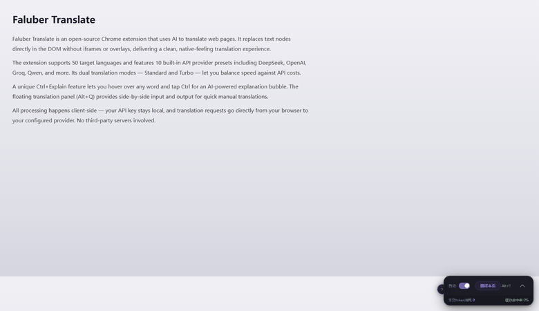
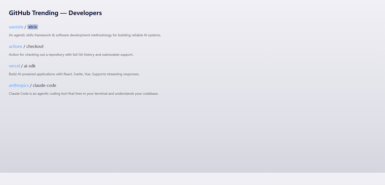
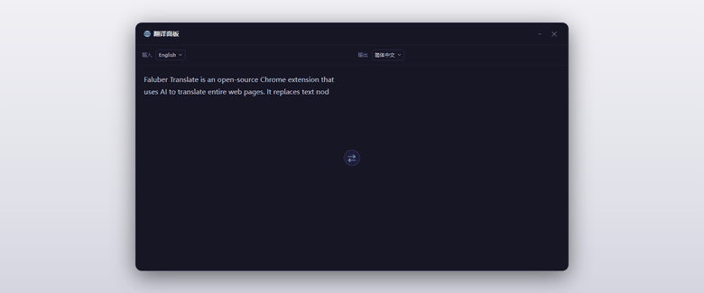
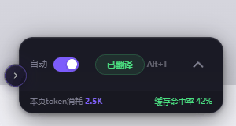
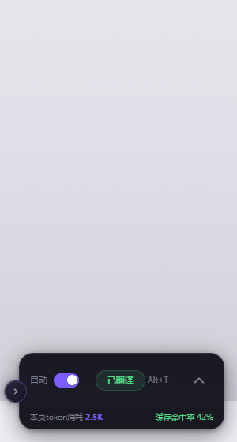

[中文](README.md) | [English](README.en.md) | [繁體中文](README.zh-TW.md) | [日本語](README.ja.md) | [한국어](README.ko.md) | [Русский](README.ru.md) | [العربية](README.ar.md)

<div align="center">
  

  # 🌐 Faluber Translate

  ### AI 智能网页翻译插件 — 50 种语言，10 家 API 提供商

  
  
  

  <br>

  <a href="https://github.com/hywihq-boop/faluber-Ai-Translate/releases"></a>
  &nbsp;
  <a href="https://github.com/hywihq-boop/faluber-Ai-Translate"></a>
</div>

<br>

> **Faluber Translate** 是一款基于 AI 的 Chrome 浏览器翻译插件。直接在 DOM 中替换文本节点——不用 iframe，不用浮层。纯净的翻译体验，支持 **50 种目标语言**、**10 家内置 API 提供商**、**双档翻译模式**、**智能双层缓存 — 重复内容零 token 消耗**。

---

## 📸 效果截图

<div align="center">
  <p><em>🎬 整页翻译 — 点击 <kbd>Alt+T</kbd>，英文逐段翻译成中文</em></p>
  
  <br><br>

  <p><em>🎬 Ctrl + 智能解释 — 鼠标指向词汇并按 <kbd>Ctrl</kbd>，AI 弹出解释气泡</em></p>
  
  <br><br>

  <p><em>🎬 翻译面板 <kbd>Alt+Q</kbd> — 输入文字，即时获得翻译</em></p>
  
  <br><br>

  <p><em>🎬 悬浮球收折 / 详情面板展开 — 动图演示</em></p>
  
  &nbsp;
  
</div>

---

## ✨ 核心功能

<table>
<tr>
<td width="50%">

### 🚀 一键整页翻译
点击悬浮球或按 <kbd>Alt+T</kbd> 翻译整个页面。文本节点级 DOM 替换，不破坏页面结构。支持自动检测源语言。

</td>
<td width="50%">

### 🔍 Ctrl + 智能解释
鼠标指向任意词汇 + 单击 <kbd>Ctrl</kbd> 弹出 AI 解释气泡。选中文字 + <kbd>Ctrl</kbd> 解释整段。两级回退：NLP 提示词 → HTML 检测。

</td>
</tr>
<tr>
<td width="50%">

### ⚡ 双档翻译模式
**标准** — 3 并发，视野优先，速度与消耗均衡。<br>
**极速** — 8 并发，全页翻译，速度拉满。

</td>
<td width="50%">

### 🔑 多 API 管理
内置 10 家提供商预设（DeepSeek、OpenAI、Groq、通义千问...）。保存多个配置随时切换。自动拉取模型。支持自定义接口。

</td>
</tr>
<tr>
<td width="50%">

### 📋 翻译面板 <kbd>Alt+Q</kbd>
浮动左右布局输入/输出面板。实时翻译，独立于页面翻译。支持任意语言对。

</td>
<td width="50%">

### 💾 智能缓存 — 省钱利器
内存 + 持久化双层缓存，重复文本命中即返回，**不消耗 token**。最多 2,000 条，1 小时 TTL。每 30 秒自动存盘，切换语言自动清除。缓存命中率实时可见。

</td>
</tr>
</table>

---

## 📦 安装

### 方法一：下载 Release 压缩包（推荐）

1. 打开 [Releases](https://github.com/hywihq-boop/faluber-Ai-Translate/releases) 页面
2. 下载最新版 `faluber-Ai-Translate-vX.X.X.zip`
3. 打开 `chrome://extensions`，开启右上角**开发者模式**
4. 将下载的 zip 文件**直接拖入**浏览器窗口
5. 完成！

### 方法二：下载源码 zip

1. 在仓库主页点击绿色 **Code** 按钮 → Download ZIP
2. 同样拖入 `chrome://extensions` 即可

### 配置与使用

| 步骤 | |
|------|---|
| **配置 API** | 点击插件图标 → 选择提供商 → 填入 API Key → 测试连接 → 保存 |
| **开始翻译** | 打开任意网页 → 点击右下角悬浮球或按 <kbd>Alt+T</kbd> |

---

## 🔧 API 提供商

| 提供商 | API 地址 |
|--------|----------|
| ⭐ DeepSeek | `https://api.deepseek.com/v1` |
| OpenAI | `https://api.openai.com/v1` |
| Groq | `https://api.groq.com/openai/v1` |
| Together AI | `https://api.together.xyz/v1` |
| OpenRouter | `https://openrouter.ai/api/v1` |
| SiliconFlow | `https://api.siliconflow.cn/v1` |
| Moonshot | `https://api.moonshot.cn/v1` |
| 智谱 | `https://open.bigmodel.cn/api/paas/v4` |
| 阿里百炼 | `https://dashscope.aliyuncs.com/compatible-mode/v1` |
| 自定义 | 任意 OpenAI 兼容端点 |

---

## 🛠️ 工作原理

```
用户触发翻译
  → Content Script 遍历 DOM，收集可见文本节点
  → 可见性检测 → CJK 去重 → 最小长度过滤 → 缓存去重
  → 按 Y 坐标排序，相邻合并 → 分包 → Service Worker（3–8 并发）
  → 调 AI API（OpenAI 兼容格式）→ 返回 → DOM 文本替换
  → 实时进度条 + 完成通知
```

### 模式对比

| | 标准 | 极速 |
|---|------|------|
| 并发数 | 3 | 8 |
| 分批大小 | 400 字符 | 250 字符 |
| 范围 | 可见区域 | 全页 |
| 滚动检测 | ✅ | — |
| 悬停检测 | ✅ | — |
| 动态内容 | ✅ | ✅ |

---

## 🌍 语言支持

<details>
<summary><b>50 种目标语言 + 20 种界面语言 — 展开查看</b></summary>
<br>

`简体中文` `繁體中文` `English` `日本語` `한국어` `Français` `Deutsch` `Español` `Português` `Русский` `العربية` `हिन्दी` `ไทย` `Tiếng Việt` `Italiano` `Nederlands` `Polski` `Türkçe` `Bahasa Indonesia` `Svenska` `Dansk` `Suomi` `Norsk` `Čeština` `Română` `Magyar` `Ελληνικά` `עברית` `Українська` `Melayu` `Filipino` `বাংলা` `اردو` `فارسی` `Kiswahili` `தமிழ்` `తెలుగు` `मराठी` `ગુજરાતી` `ಕನ್ನಡ` `മലയാളം` `ਪੰਜਾਬੀ` `Български` `Slovenčina` `Lietuvių` `Latviešu` `Eesti` `Slovenščina` `Hrvatski` `Српски`

</details>

---

## 📂 项目结构

```
faluber translate/
├── manifest.json
├── background/service-worker.js   # API 调用与消息路由
├── content/
│   ├── content.js                 # DOM 文本提取与替换
│   └── content.css                # 悬浮球样式
├── popup/
│   ├── popup.html                 # 设置弹窗
│   ├── popup.js                   # 多 API 管理
│   └── popup.css
├── icons/                         # 扩展图标
├── assets/                        # 截图
└── docs/                          # 产品官网
```

---

## 🔒 隐私

- API Key 仅存储在 Chrome **本地**同步存储中
- 翻译请求**直接**从浏览器发送到你的 API 提供商
- **不经过第三方服务器** — 数据只在你和 API 提供商之间传输

---

<div align="center">
  <br>
  <a href="https://github.com/hywihq-boop/faluber-Ai-Translate">⭐ Star</a> ·
  <a href="https://github.com/hywihq-boop/faluber-Ai-Translate/releases">📦 下载</a> ·
  <a href="https://github.com/hywihq-boop/faluber-Ai-Translate/issues">🐛 反馈 Bug</a> ·
  <a href="LICENSE">📝 MIT</a>
</div>
